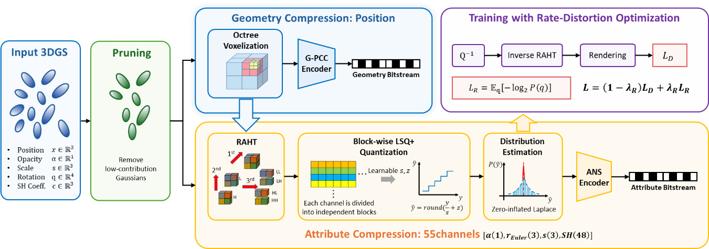
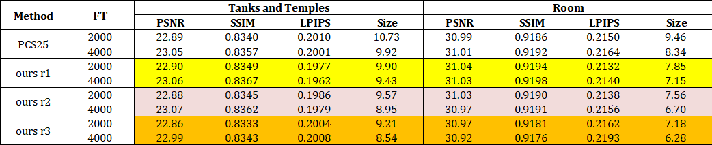
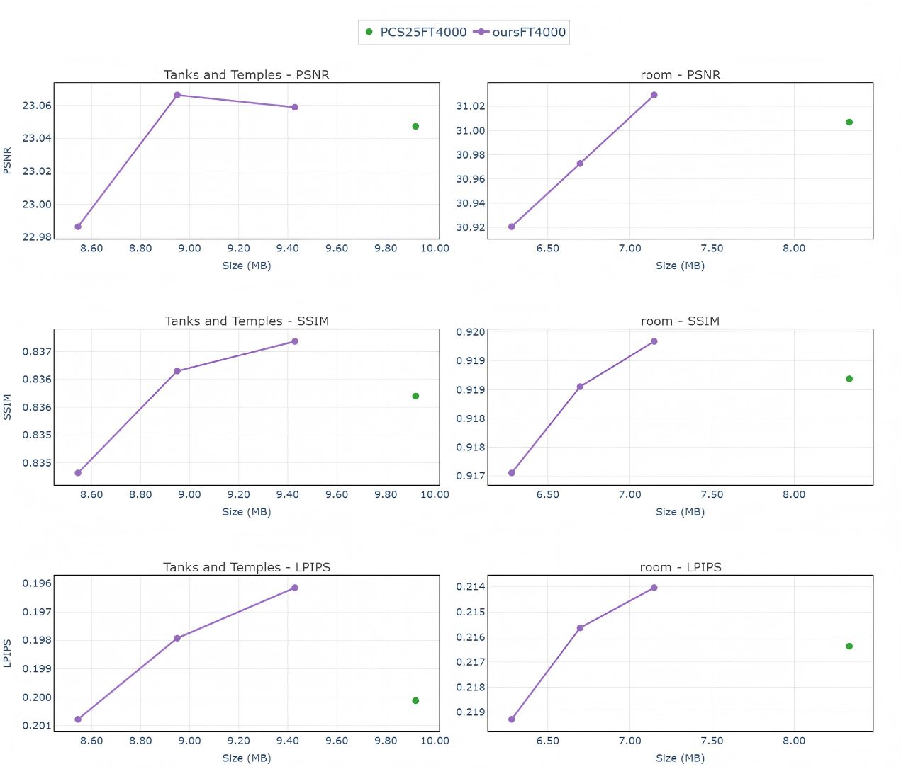

# Progress Summary on RAHT-based 3DGS Compression

This document summarizes our recent progress on RAHT-based 3D Gaussian Splatting compression, including the main methodological changes, the current training objective, and preliminary experimental results. The overall framework still follows the “position compression + attribute RAHT transform coding” pipeline, while the rate modeling, quantization, and entropy coding modules in the attribute compression branch have been redesigned.

The current implementation supports the full training, compression, and decoding pipeline. The main changes are summarized as follows:

1. The original RAHT AC sparsity loss $L_S$ is replaced by a **zero-inflated Laplace rate proxy**;
2. *Channel-wise bit allocation* is replaced by **block-wise LSQ+**<sup>[2]</sup>;
3. Deflate coding for attribute symbols is replaced by **ANS coding using fitted probability tables**.

<p align="center">
  
</p>


<p align="center"><b>Figure 1.</b> Current implementation framework. The position branch uses octree / G-PCC coding, while the attribute branch uses RAHT, block-wise LSQ+, zero-inflated Laplace modeling, and ANS coding.</p>

## 1. Methodological Changes

### 1.1 Replacing $L_S$ with $L_R$: A Zero-inflated Laplace Rate Proxy

The original sparsity term $L_S$ can be viewed as a transform-domain proxy for compressibility, and is written as:

$$
L_S = \frac{1}{C}\sum_{c=1}^{C}\sum_n |y_{c,n}|.
$$

This term encourages the RAHT AC coefficients to become smaller and sparser. In our current implementation, this role is taken over by an explicit rate proxy that is more closely related to entropy coding. Specifically, the RAHT AC coefficients are first quantized, and the rate is then estimated from the probability of the resulting quantized symbols.

Let the n-th quantized symbol in the b-th block of the c-th attribute channel be:

$$
q_{c,b,n}.
$$

Empirically, the quantized RAHT coefficients are often close to a Laplace distribution, but with a pronounced peak around the center symbol. We therefore model the symbol distribution of each channel-block using a zero-inflated Laplace distribution:

$$
P_{c,b}(q)=
\begin{cases}
\pi_{c,b}, & q=m_{c,b}, \\
(1-\pi_{c,b})\dfrac{P_L(q;\mu_{c,b},\beta_{c,b})}{1-P_L(m_{c,b};\mu_{c,b},\beta_{c,b})}, & q\neq m_{c,b}.
\end{cases}
$$

Where, $m_{c,b}$ denotes the center symbol, $\pi_{c,b}$ denotes the additional probability mass assigned to the center symbol, and $P_L$ denotes the discretized Laplace probability.

$$
\hat{R}=
\sum_{c=1}^{55}\sum_{b=1}^{B}\sum_n
-\log_2 P_{c,b}(q_{c,b,n}).
$$

The rate loss is defined as the average estimated rate per point:

$$
L_R=\frac{\hat{R}}{N}.
$$

Thus, L<sub>R</sub> replaces L<sub>S</sub> as the main compression-oriented objective in the current training. We have also observed a clear linear relationship between the estimated $L_R$ and the final encoded bitstream size.

### 1.2 Block-wise LSQ+ Learnable Quantization

For attribute quantization, fixed bit-depth min-max quantization is replaced by block-wise LSQ+<sup>[2]</sup>. Each channel-block is assigned an independent learnable scale and offset:

```math
q_{c,b,n}
=
\mathrm{round}
\left(
\mathrm{clip}
\left(
\frac{y_{c,b,n}}{s_{c,b}} + z_{c,b}, Q_n, Q_p
\right)
\right).
```

```math
\hat{y}_{c,b,n}
=
s_{c,b}(q_{c,b,n}-z_{c,b}).
```

Where, s<sub>c,b</sub> and z<sub>c,b</sub> denote the learnable quantization step size and offset for the b-th block of the c-th channel. During training, the straight-through estimator is used to approximate the gradient of the rounding operation, allowing the quantization parameters to be optimized by backpropagation.

We also tested LSQ<sup>[3]</sup>, which learns only the quantization step size, and HMQ<sup>[4]</sup>, which searches over bit-depths. In the current experiments, LSQ+ is more stable, mainly because its learnable offset better adapts to the coefficient distributions of different blocks.

### 1.3 ANS Entropy Coding Aligned with the Probability Prior

The quantized attribute symbols are encoded using ANS, aligned with the rate model used during training:

$$
\text{RAHT coefficients}
\rightarrow
\text{LSQ+ symbols}
\rightarrow
\text{ZIL probability model}
\rightarrow
\text{ANS bitstream}.
$$

Specifically, the quantized symbols in each channel-block are used to estimate the zero-inflated Laplace parameters. A discrete CDF is then constructed from the fitted distribution and used for ANS coding. This makes the training-time rate loss L<sub>R</sub> better aligned with the actual exported bitstream. This direction is also consistent with recent 3DGS compression work that improves coding efficiency through quantization and entropy coding<sup>[5]</sup>.

## 2. Current Training Objective

The current training loss consists of a rendering distortion term and an explicit rate term:

$$
L=(1-\lambda_R)L_D+\lambda_R L_R.
$$

where:

$$
L_D=(1-\lambda_{\mathrm{DSSIM}})L_1+
\lambda_{\mathrm{DSSIM}}(1-\mathrm{SSIM}),
$$

$$
L_R=\frac{1}{N}
\sum_{c=1}^{55}\sum_{b=1}^{B}\sum_n
-\log_2 P_{c,b}(q_{c,b,n}).
$$

## 3. Experimental Setup

For efficient parameter tuning, We first used the ***room*** scene from Mip-NeRF 360 to select parameters, and then conducted preliminary evaluations on the *room* sequence and the **Tanks & Temples**dataset. The comparison is made against results obtained using the PCS25 code under the same pretraining and fine-tuning pipeline.

The current setup is as follows:

- Pretrained model: trained for 30,000 iterations using the original 3D Gaussian Splatting code and standard configuration;
- Fine-tuning iterations: 2,000 and 4,000 iterations;
- Evaluation metrics: PSNR, SSIM, LPIPS, and compressed model size;
- The current results are still preliminary, and the parameters may not yet be optimal for the full datasets.

## 4. Results

<p align="center">
  
</p>


<p align="center"><b>Table 1.</b> Preliminary comparison between the current method and the PCS25 code results on Tanks & Temples and Room.</p>

The current results show a consistent trend: at comparable rendering quality, the proposed changes generally lead to a smaller compressed model size. Increasing the rate constraint further improves compression, although it also introduces some quality degradation. The preliminary results on both Tanks & Temples and Room follow this trend.

<p align="center">
  
</p>


<p align="center"><b>Figure 2.</b> RD curves under the FT4000 setting.</p>

These results are mainly intended to validate the technical direction and the current parameter range, rather than to serve as final results. We are also modifying the pruning module, with the goal of making the point distribution after pruning better aligned with the subsequent RAHT / LSQ+ quantization. Therefore, there is still room for further improvement.

## References

[1] Gallina, Annalisa, et al. "Improved RAHT-based Compression of 3D Gaussian Splats." *Picture Coding Symposium 2025*. 2025.

[2] Yash Bhalgat, Jinwon Lee, Markus Nagel, Tijmen Blankevoort, Nojun Kwak. “LSQ+: Improving Low-bit Quantization Through Learnable Offsets and Better Initialization.” *CVPR Workshops*, 2020.

[3] Steven K. Esser et al. “Learned Step Size Quantization.” arXiv preprint arXiv:1902.08153, 2019.

[4] Hai Victor Habi, Roy H. Jennings, Arnon Netzer. “HMQ: Hardware Friendly Mixed Precision Quantization Block for CNNs.” *ECCV*, 2020.

[5] Chunyang Fu et al. “Voxel-GS: Quantized Scaffold Gaussian Splatting Compression with Run-Length Coding.” *DCC*, 2026.
